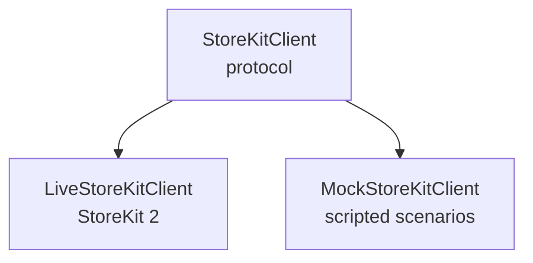

# Building a Modern StoreKit 2 Async Service with Full Mocking Support

## Overview
StoreKit 2 brought powerful async/await APIs, safer transaction handling, and improved subscription status checks. However, real-world teams still face three major pain points:

1. **StoreKit is difficult to test** — sandbox accounts are brittle, slow, and require configuration.
2. **The system purchase sheet cannot be triggered in tests**, making UX reviews hard.
3. **PMs and developers cannot easily walk through the purchase flow** without a working App Store configuration.

This article defines a modern StoreKit 2 architecture that solves these problems through:
- An async service layer
- A clean protocol abstraction
- A deterministic mock system
- A mock UI that simulates the Apple purchase sheet for demos & UX validation

---

## 1. Architecture Goals

A modern StoreKit service should:
- Use async/await exclusively  
- Provide an easy-to-mock protocol  
- Emit purchase events as an `AsyncStream`  
- Separate the **core business flow** from **UI presentation**  
- Allow scripted purchase scenarios for demos and testing  
- Support unit testing without StoreKitTest or sandbox users

This leads to the following architecture:



The UI talks only to `StoreKitClient`.

---

## 2. Defining the Core Protocol

```swift
public protocol StoreKitClient: Sendable {
    func loadProducts(ids: [String]) async throws -> [Product]
    func purchase(id: String) async throws -> PurchaseResult
    func restore() async throws -> [Transaction]

    var events: AsyncStream<StoreEvent> { get }
}

public enum StoreEvent {
    case purchaseStarted(String)
    case confirmationSheetPresented
    case userConfirmed
    case userCancelled
    case purchaseSuccess(Transaction)
    case purchaseFailed(Error)
}
```

This creates a **testable boundary** that both:
- Live StoreKit and
- Mock StoreKit

can implement.

---

## 3. Implementing the Live StoreKit Client

```swift
actor LiveStoreKitClient: StoreKitClient {
    private let eventsContinuation: AsyncStream<StoreEvent>.Continuation
    public let events: AsyncStream<StoreEvent>

    init() {
        (events, eventsContinuation) = AsyncStream.makeStream()
    }

    func loadProducts(ids: [String]) async throws -> [Product] {
        try await Product.products(for: ids)
    }

    func purchase(id: String) async throws -> PurchaseResult {
        guard let product = try await loadProducts(ids: [id]).first else {
            throw StoreError.productNotFound
        }

        eventsContinuation.yield(.purchaseStarted(id))

        let result = try await product.purchase()

        switch result {
        case .success(let verification):
            let transaction = try verification.payload
            eventsContinuation.yield(.purchaseSuccess(transaction))
            await transaction.finish()
            return .success(transaction)

        case .userCancelled:
            eventsContinuation.yield(.userCancelled)
            throw StoreError.userCancelled

        case .pending:
            eventsContinuation.yield(.purchaseFailed(StoreError.pending))
            throw StoreError.pending

        @unknown default:
            eventsContinuation.yield(.purchaseFailed(StoreError.unknown))
            throw StoreError.unknown
        }
    }

    func restore() async throws -> [Transaction] {
        var restored: [Transaction] = []
        for await result in Transaction.currentEntitlements {
            if case .verified(let t) = result { restored.append(t) }
        }
        return restored
    }
}
```

This actor:
- Ensures thread-safety  
- Emits meaningful events  
- Handles verified transactions safely  
- Surfaces errors clearly  

---

## 4. Designing a Fully Scriptable Mock

Instead of a simple “always succeed” mock, we design ** scripted scenarios **:

```swift
public struct MockScenario {
    public let productID: String
    public let steps: [MockStep]
}

public enum MockStep {
    case delay(Duration)
    case presentSheet
    case userConfirms
    case userCancels
    case fail(Error)
    case succeed
}
```

Mock client implementation:

```swift
actor MockStoreKitClient: StoreKitClient {
    private let scenario: MockScenario
    private let eventsContinuation: AsyncStream<StoreEvent>.Continuation
    let events: AsyncStream<StoreEvent>

    init(scenario: MockScenario) {
        self.scenario = scenario
        (events, eventsContinuation) = AsyncStream.makeStream()
    }

    func loadProducts(ids: [String]) async throws -> [Product] {
        return [Product(id: scenario.productID, displayName: "Mock Product")]
    }

    func purchase(id: String) async throws -> PurchaseResult {
        for step in scenario.steps {
            switch step {
            case .delay(let duration):
                try await Task.sleep(for: duration)

            case .presentSheet:
                eventsContinuation.yield(.confirmationSheetPresented)

            case .userConfirms:
                eventsContinuation.yield(.userConfirmed)

            case .userCancels:
                eventsContinuation.yield(.userCancelled)
                throw StoreError.userCancelled

            case .fail(let error):
                eventsContinuation.yield(.purchaseFailed(error))
                throw error

            case .succeed:
                let transaction = Transaction.mock(id: id)
                eventsContinuation.yield(.purchaseSuccess(transaction))
                return .success(transaction)
            }
        }

        throw StoreError.invalidScenario
    }
}
```

This creates a **deterministic, fully controllable simulation**.

---

## 5. Mocking the UI Experience

The biggest missing piece in existing libraries is **a mock sheet that looks like Apple’s purchase UI**.

Design goals:
- Appears as an overlay  
- Animates in like the system sheet  
- Shows product name & price  
- Supports cancel & confirm  
- Emits events into the mock PurchaseFlow  

### Example UI (SwiftUI)

```swift
struct MockPurchaseSheet: View {
    let state: MockUIState
    let onConfirm: () -> Void
    let onCancel: () -> Void

    var body: some View {
        VStack(spacing: 16) {
            Text("Confirm Purchase")
                .font(.headline)

            Text(state.productName)

            if state.isProcessing {
                ProgressView()
            }

            HStack {
                Button("Cancel", action: onCancel)
                Button("Confirm", action: onConfirm)
            }
        }
        .padding()
        .background(.thinMaterial)
        .cornerRadius(20)
        .shadow(radius: 20)
        .transition(.move(edge: .bottom))
    }
}
```

Your mock scenario triggers this sheet.

PMs and designers can:
- Try cancels  
- Try confirmations  
- Watch loading states  
- Observe error flows  
- Do interactive demos without a live product  

This is huge for realism and UX clarity.

---

## 6. Handling Error States Cleanly

### Define all domain errors:

```swift
enum StoreError: Error {
    case productNotFound
    case userCancelled
    case pending
    case network
    case storeUnavailable
    case invalidScenario
    case unknown
}
```

### Ensure the UI maps errors to messages

The UI binder observes events:

```swift
func bindEvent(_ event: StoreEvent) {
    switch event {
    case .purchaseFailed(let error):
        errorMessage = error.localizedDescription
    case .userCancelled:
        showCancelledBanner = true
    case .purchaseSuccess:
        showSuccessBanner = true
    default:
        break
    }
}
```

This forms a **predictable state machine**, a hallmark of senior engineering.

---

## 7. Recommended Mock Scenarios

Provide canned scenarios:

```swift
extension MockScenario {
    static let happyFlow = MockScenario(
        productID: "pro_upgrade",
        steps: [
            .delay(.seconds(0.5)),
            .presentSheet,
            .delay(.seconds(1)),
            .userConfirms,
            .delay(.seconds(1)),
            .succeed
        ]
    )

    static let cancelled = MockScenario(
        productID: "pro_upgrade",
        steps: [.presentSheet, .userCancels]
    )

    static let networkFailure = MockScenario(
        productID: "pro_upgrade",
        steps: [.presentSheet, .userConfirms, .fail(StoreError.network)]
    )
}
```

Teams immediately get:
- Reliable demos  
- Clean unit-test behaviors  
- Easy QA reproduction  
- Predictable workflows  

---

## 8. Recommended Folder Structure

```
StoreKitService/
 ├─ Sources/
 │   ├─ Protocols/
 │   ├─ LiveStoreKit/
 │   ├─ MockStoreKit/
 │   └─ UI/
 ├─ Tests/
 │   ├─ MockScenariosTests.swift
 │   ├─ LiveStoreKitTests.swift
 │   └─ UIFlowSnapshotTests.swift
 └─ DemoApp/
     └─ PurchaseDemo.swift
```

This structure creates a professional, testable architecture appropriate for senior-level work.

---

## 9. Closing Thoughts

StoreKit is one of the most difficult areas of iOS to:
- test  
- mock  
- demo  
- UX validate  

By splitting the world into:
- **StoreKitClient (protocol)**
- **LiveStoreKitClient**
- **MockStoreKitClient**
- **Mock UI with scripted flows**

…you produce a *true* StoreKit platform that:
- teams can rely on  
- PMs can demo confidently  
- QA can test deterministically  
- other engineers can extend cleanly  

This turns your StoreKit integration from a fragile subsystem into a predictable, well-architected foundation.

---

## 🤖 Tooling Note

Portions of drafting and editorial refinement in this repository were accelerated using large language models (including ChatGPT, Claude, and Gemini) under direct human design, validation, and final approval. All technical decisions, code, and architectural conclusions are authored and verified by the repository maintainer.
