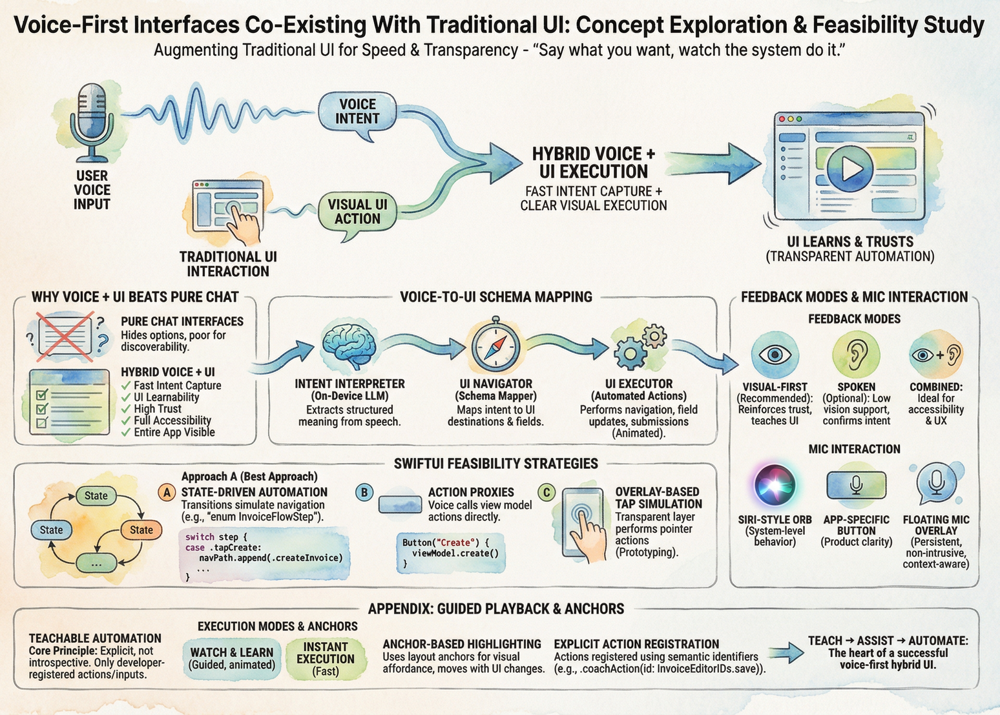

# Voice‑First Interfaces Co‑Existing With Traditional UI  
### Concept Exploration & Feasibility Study

---

# 1. Introduction

Voice‑first computing is finally reaching a maturity point where it can *augment* traditional UI rather than *replace* it. The emerging model is:

> **“Say what you want, watch the system do it.”**



This hybrid pattern addresses two simultaneous needs:

1. **Speed** — Speaking a complex command can be 10× faster than navigating forms.  
2. **Transparency** — Users still want to *see* the UI perform actions so they learn and trust the system.

This study explores how a voice‑driven interface could sit **on top of** an existing app UI using:

- Apple’s **Speech framework**
- **Intent-style natural language parsing**
- Apple’s **on-device lightweight LLM**
- A new concept: **Voice‑to‑UI Schema Mapping**
- Automated UI execution (pointer‑tap simulation or state-driven flows)

# 2. Why Voice + Traditional UI Beats Pure Chat Interfaces

Chat-only interfaces hide options and are poor for discoverability.

Hybrid voice + UI provides:

- **Fast intent capture**
- **Clear visual execution**
- **UI learnability**
- **Higher trust**
- **Full accessibility retention**
- **The entire app remains visible and intuitive**

This is not replacing UI but elevating it.

---

# 3. Concept: Voice‑to‑UI Schema Mapping

A schema defines:

- Domain concepts (Invoice, Customer, LineItem)
- UI destinations and fields
- Valid transformations (navigate, fill, apply discount)

A workflow:

1. **Intent Interpreter**  
   Uses Apple’s on-device LLM to extract structured meaning.

2. **UI Navigator**  
   Maps the intent to UI destinations.

3. **UI Executor**  
   Performs actions:
   - Navigation
   - Field updates
   - Submissions  
   optionally animated for user transparency.

---

# 4. Feedback Modes: Spoken? Visual? Both?

### Visual-first (recommended)
- Reinforces trust
- Teaches UI
- Clear and immediate

### Spoken (optional)
- Good for low vision users
- Confirms intent interpretation

### Combined
Ideal for accessibility + mainstream UX.

---

# 5. Mic Interaction: Siri-like or App-specific?

### Siri-style orb
Familiar but implies system-level behavior.

### App-specific mic button
Best for product clarity.

### Floating mic overlay
Ideal:
- Persistent
- Non-intrusive
- Context-aware animations (listening / processing)

---

# 6. Minimal UI Requirements

- Each UI field/element must have semantic meaning (ID or role)
- SwiftUI navigation must be deterministic
- Views must be bindable through state or view models
- Actions must be invocable programmatically

Small adjustments can make the whole app “voice-drivable.”

---

# 7. Accessibility Impact

Voice becomes a **first-class accessibility dimension**:

- Full app operation through speech
- Visual reinforcement for partial vision users
- Eliminates complex VoiceOver gestures
- Drastically reduces friction for data entry apps

---

# 8. Feasibility in SwiftUI Today

### Voice Recognition — Easy  
`SFSpeechRecognizer` and on-device dictation.

### Intent Interpretation — Now Possible  
Apple’s lightweight on-device LLM can produce structured actions.

### UI Execution — Partial but workable  
SwiftUI has no direct tap simulation, but three strategies exist:

---

## Strategy A — **State-Driven Automation** (Best Approach)

Transitions simulate navigation:

```swift
enum InvoiceFlowStep {
    case openInvoices
    case tapCreate
    case fillCustomer(String)
    case addItem(String, Int, Double)
    case applyDiscount(Double)
    case save
}
```

A controller drives these steps; SwiftUI animates automatically.

---

## Strategy B — **Action Proxies**

Instead of real taps:

```swift
Button("Create") { viewModel.create() }
```

Voice system simply calls `viewModel.create()`.

---

## Strategy C — **Overlay-Based Tap Simulation**

A transparent layer performs pointer actions.  
Not ideal, but feasible for prototypes.

---

# 9. Prototype: Auto‑Navigation Example

```swift
final class VoiceUIController: ObservableObject {
    @Published var steps: [InvoiceFlowStep] = []

    func run(_ intent: InvoiceIntent) {
        steps = [
            .openInvoices,
            .tapCreate,
            .fillCustomer(intent.customer),
            .addItem("Chocolate Bar", 3, 1.20),
            .addItem("Apple", 2, 0.50),
            .applyDiscount(0.10),
            .save
        ]
    }
}
```

UI responds:

```swift
struct InvoiceContainerView: View {
    @EnvironmentObject var voice: VoiceUIController
    @State private var navPath: [Screen] = []

    var body: some View {
        NavigationStack(path: $navPath) {
            InvoiceListView()
                .onChange(of: voice.steps) { steps in
                    Task { await runSteps(steps) }
                }
        }
    }

    func runSteps(_ steps: [InvoiceFlowStep]) async {
        for step in steps {
            switch step {
            case .tapCreate:
                navPath.append(.createInvoice)
            case .fillCustomer(let name):
                model.customer = name
            case .addItem(let name, let qty, let price):
                model.addLineItem(name: name, qty: qty, price: price)
            case .applyDiscount(let pct):
                model.discount = pct
            case .save:
                model.save()
            default:
                break
            }
            try? await Task.sleep(for: .milliseconds(350))
        }
    }
}
```

This is achievable **today**.

---

# 10. How This Changes the App Landscape

### 1. Voice becomes a *first-class UI citizen*  
### 2. Productivity apps become dramatically faster  
### 3. Beginners gain immediate mastery  
### 4. Accessibility reaches a new level  
### 5. Hybrid “voice + visual execution” becomes a new UX paradigm  
### 6. Creates feature discoverability missing from chat UI systems

This could be the next generational input mode on iOS.

---

# 11. Conclusion

A hybrid voice-first architecture layered on top of existing UI is **practical, feasible, and transformative**.

- Users speak intent  
- UI performs actions  
- The user learns by watching  
- Accessibility improves  
- Trust increases  
- Existing apps gain superpowers without redesigning everything

A real-world prototype using SwiftUI state-driven automation is achievable today.

# Appendix: Guided Playback, Anchors, and Explicit UI Registration

This section expands on the **voice-first hybrid UI** concept by documenting several important architectural discoveries made while exploring *guided UI playback* in SwiftUI.

The goal is to support **voice-driven automation that teaches users visually**, without relying on unsafe view introspection or brittle UI automation techniques.

---

## Core Principle

> **Voice-guided UI must be explicit, not introspective.**  
> Only developer-registered actions and inputs are eligible for playback.

SwiftUI does not expose a supported way to discover views dynamically or “tap” controls by label. Instead, we build a system where the developer **explicitly registers**:

- what actions are safe to invoke
- what inputs can be mutated
- where those controls appear (for visual guidance)

---

## Highlighting vs. Executing Actions

A critical distinction emerged:

- **Highlighting** is a *visual affordance* (teaching + trust)
- **Executing an action** is simply invoking a stored closure

These two concerns must be decoupled.

### Highlighting
- Uses SwiftUI layout anchors
- May fail gracefully (e.g., offscreen, transition in progress)
- Never blocks execution

### Execution
- Calls a developer-supplied closure
- Mutates state or triggers navigation
- Does *not* depend on geometry

At worst, the highlight may not appear — but the action still executes safely.

---

## Why Geometry Storage Is Dangerous

SwiftUI layouts are ephemeral:

- views are recreated frequently
- frames change during animations
- navigation invalidates geometry
- dynamic type and rotation affect layout

Storing a `CGRect` for later use is fragile and will break.

---

## The Anchor-Based Solution

Instead of storing frames, each registered UI element publishes a **layout anchor**, which is resolved *live* by an overlay.

### Registering an Anchor

```swift
.anchorPreference(
    key: CoachAnchorKey.self,
    value: .bounds
) { anchor in
    [id: anchor]
}
```

- Anchors are symbolic references, not coordinates
- They remain valid as long as the view is in the hierarchy

---

### Resolving Anchors in an Overlay

```swift
.overlayPreferenceValue(CoachAnchorKey.self) { anchors in
    GeometryReader { geo in
        if let anchor = anchors[currentHighlightedID] {
            let rect = geo[anchor]
            HighlightView(rect: rect)
        }
    }
}
```

This ensures:
- highlights move with layout changes
- animations stay in sync
- navigation transitions are respected

---

## Explicit Action Registration

Actions are registered explicitly using semantic identifiers.

```swift
Button("Save") {
    saveInvoice()
}
.coachAction(id: InvoiceEditorIDs.save) {
    saveInvoice()
}
```

The registry stores:
- the action ID
- a callable closure
- the current anchor (if visible)

The playback engine never presses views — it invokes closures.

---

## Inputs Are State Mutations, Not Gestures

Text entry, picker selection, toggles, and sliders are handled by **setting bound state**, not simulating user gestures.

### Text Field Example

```swift
TextField("Customer", text: $model.customerName)
  .coachInput(
      id: InvoiceEditorIDs.customerName,
      set: { model.customerName = $0 }
  )
```

Playback step:

```swift
.highlight(.invoiceEditorCustomer)
.setText(.invoiceEditorCustomer, "John")
```

This approach is:
- deterministic
- testable
- animation-friendly
- aligned with SwiftUI’s data flow

---

## Screen-Scoped Identifiers

A single global ID file does not scale.

Instead:
- IDs are defined per screen or feature
- uniqueness is guaranteed by namespacing

Example:

```swift
enum InvoiceEditorIDs {
    static let customerName = "invoice.editor.customerName"
    static let addItem      = "invoice.editor.addItem"
    static let save         = "invoice.editor.save"
}
```

This keeps ownership local and avoids merge conflicts.

---

## Interaction Blocking During Playback

During guided playback, user interaction should be temporarily disabled to prevent accidental interference.

This can be done via:
- a global non-hit-testing overlay
- or locally disabling controls

Playback remains:
- cancelable
- transparent
- predictable

---

## Two Execution Modes

A key product insight was the need for **two distinct execution modes**:

### 1. Watch & Learn (Guided Mode)
- highlights each control
- animates transitions
- teaches the user
- UI-driven navigation

### 2. Instant Execution (Fast Mode)
- skips UI playback
- uses router + state directly
- minimal feedback
- optimized for power users

Both modes share:
- intent parsing
- planning
- registered actions

They differ only in execution strategy.

---

## Final Takeaway

This architecture enables:

- voice-first workflows
- teachable automation
- accessibility-friendly guidance
- deterministic execution
- incremental adoption

By combining **explicit registration**, **anchor-based highlighting**, and **intent-driven playback**, we can build voice-assisted UIs that are both powerful and trustworthy — without fighting SwiftUI’s design.

---

> **Teach → Assist → Automate**  
> This progression is the heart of a successful voice-first hybrid UI.

---

*Prepared as a feasibility study for next-generation voice-driven interaction models in iOS apps.*  

---

## 🤖 Tooling Note

Portions of drafting and editorial refinement in this repository were accelerated using large language models (including ChatGPT, Claude, and Gemini) under direct human design, validation, and final approval. All technical decisions, code, and architectural conclusions are authored and verified by the repository maintainer.
